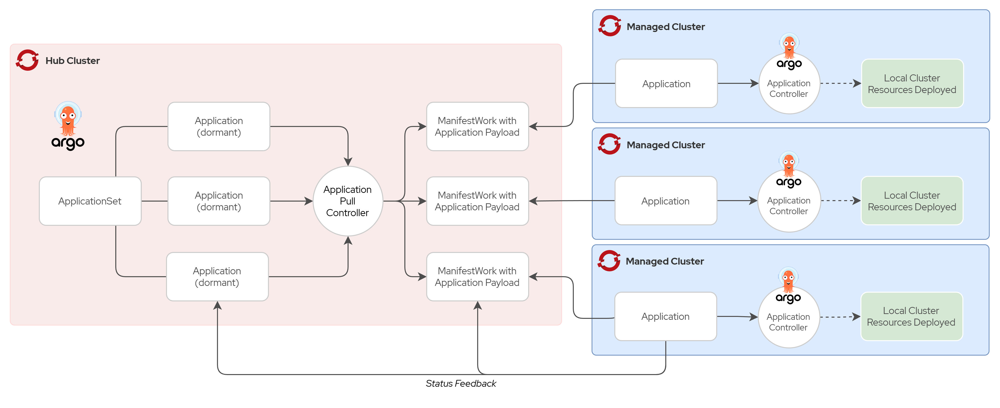
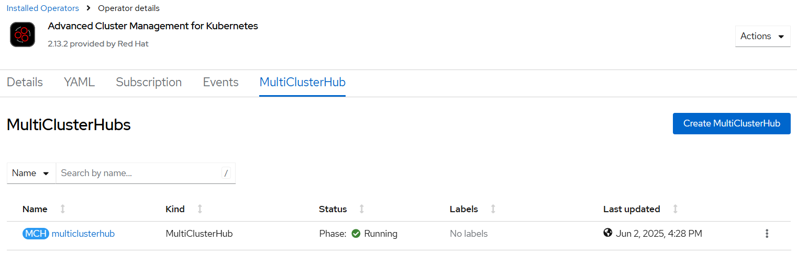
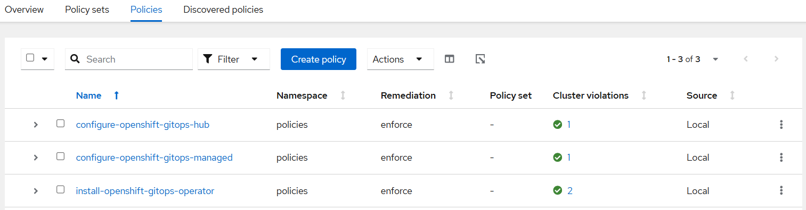

# RHACM + OpenShift GitOps Pull Model

GitOps Pull Model is a deployment strategy where application configurations are centrally managed on the ACM Hub Cluster. Managed clusters independently pull these configurations directly from a Git repository, ensuring decentralized control and streamlined operations.

This approach improves scalability, reliability, and resilience by eliminating single points of failure and distributing workloads across managed clusters.



This demonstration provides all the necessary resources to implement the GitOps Pull Model effectively.

## Prerequisites

Before you begin, ensure the following requirements are met:

1. OpenShift Container Platform version 4.16 or later.
2. Red Hat Advanced Cluster Management for Kubernetes (RHACM) version 2.13 or later.

## Installing RHACM

To install RHACM, execute the following command:

```bash
# Run the ACM installation script
sh ./00-rhacm/acm-install.sh
```

This script installs RHACM operator on your cluster, enabling centralized management and GitOps capabilities.

Access the OpenShift console and navigate to **Installed Operators > Advanced Cluster Management for Kubernetes**. Here, you should see the MultiClusterHub resource with its status displayed as **Running**.



## Configuring Policies

After installing RHACM, apply the required policies to set up the GitOps environment:

```bash
oc create namespace policies
oc apply -f ./00-rhacm/02-policies -n policies
```

### Policy Tags Overview

The policies rely on the following tags to configure the GitOps environment effectively:

- **gitops-operator**: Installs the OpenShift GitOps operator on the tagged clusters. This tag should be applied to all clusters.
- **gitops-hub**: Configures an ArgoCD instance in the tagged cluster within the namespace `gitops-hub`. This tag should be applied to the Hub Cluster.
- **gitops-managed**: Configures an ArgoCD instance in the tagged cluster within the namespace `gitops-managed`. This tag should be applied to the Managed Clusters.

After applying the tags to each cluster as described above, within a few minutes, the clusters should become compliant with the defined policies. You can verify the compliance status by navigating to **Governance > Policies** in the RHACM console. Ensure all policies display a status of **Compliant** for the respective clusters.



## Configuring Applications

With OpenShift GitOps configured on both the Hub Cluster and managed clusters, create the ApplicationSet to distribute workloads across managed clusters.

Apply this configuration on the RHACM Hub Cluster:

```bash
oc apply -f ./01-gitops/00-applications -n gitops-hub
```

## Reference

* [RHACM - Installation](https://docs.redhat.com/en/documentation/red_hat_advanced_cluster_management_for_kubernetes/2.13/html-single/install/index)
* [RHACM - Importing a cluster](https://docs.redhat.com/en/documentation/red_hat_advanced_cluster_management_for_kubernetes/2.13/html-single/clusters/index#importing-cluster)
* [RHACM - GiOps](https://docs.redhat.com/en/documentation/red_hat_advanced_cluster_management_for_kubernetes/2.13/html-single/gitops/index)
