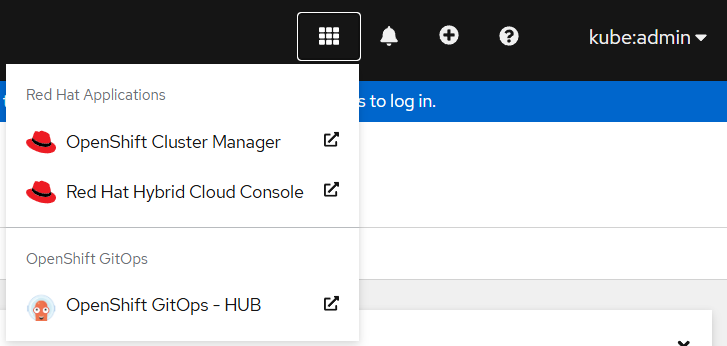
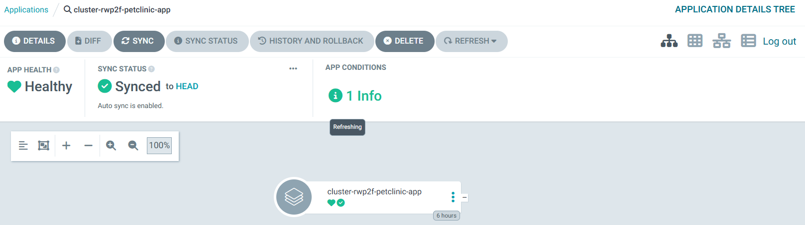
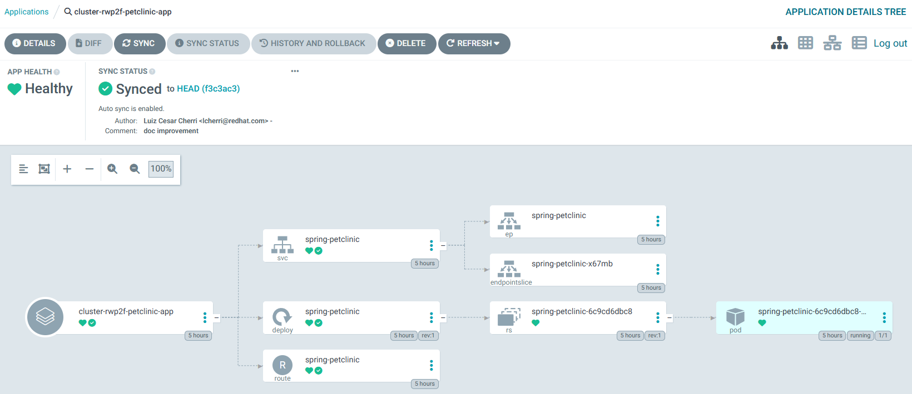

# OpenShift GitOps - Pull Model

GitOps Pull Model is a deployment strategy where application configurations are centrally managed on the ACM Hub Cluster. Managed clusters independently pull these configurations directly from a Git repository, ensuring decentralized control and streamlined operations.

This approach improves scalability, reliability, and resilience by eliminating single points of failure and distributing workloads across managed clusters.


This demonstration provides all the necessary resources to implement the GitOps Pull Model effectively.

## Prerequisites

Before you begin, ensure the following requirements are met:

1. OpenShift Container Platform version 4.16 or later.
2. Red Hat Advanced Cluster Management for Kubernetes (RHACM) version 2.13 or later.

## Installing RHACM

To install RHACM, execute the following command:

```bash
# Run the ACM installation script
sh ./00-rhacm/acm-install.sh
```

This script installs RHACM operator on your cluster, enabling centralized management and GitOps capabilities.

Access the OpenShift console and navigate to **Installed Operators > Advanced Cluster Management for Kubernetes**. Here, you should see the MultiClusterHub resource with its status displayed as **Running**.


## Configuring Groups and Permissions

**If you are not using the `kubeadmin` user**, you need to create a `gitops-admin` group and add your current user to it to ensure administrative access to the ArgoCD instances provisioned on each OpenShift cluster. Execute the following commands:

```bash
# Create a new group named gitops-admin
oc adm groups new gitops-admin

# Add the logged-in user to the gitops-admin group
oc adm groups add-users gitops-admin $(oc whoami)
```

Repeat these steps on every OpenShift cluster where ArgoCD instances will be deployed.

## Configuring Policies

Once RHACM is installed, the next step is to apply the necessary policies to configure the GitOps environment. These policies ensure that the clusters are set up correctly for GitOps operations.

### Applying Policies

Execute the following commands to create a namespace for the policies and apply them:

```bash
# Create a namespace for policies
oc create namespace policies

# Apply the GitOps policies
oc apply -f ./00-rhacm/02-policies -n policies
```

- The `policies` namespace is used to organize and manage the GitOps-related policies.
- The policy definitions in the `./00-rhacm/02-policies` directory include configurations for deploying the OpenShift GitOps operator and setting up ArgoCD instances on the clusters.

For additional details, refer to the comments within the policy source files located in the `./00-rhacm/02-policies` directory.

### Policy Labels Overview

The policies rely on the following labels to configure the GitOps environment effectively:

- **gitops-operator**: Installs the OpenShift GitOps operator on the labeled clusters. This label should be applied to all clusters.
- **gitops-hub**: Configures an ArgoCD instance in the labeled cluster within the namespace `gitops-hub`. This label should be applied to the Hub Cluster.
- **gitops-managed**: Configures an ArgoCD instance in the labeled cluster within the namespace `gitops-managed`. This label should be applied to the Managed Clusters.

After applying the tags to each cluster as described above, within a few minutes, the clusters should become compliant with the defined policies. You can verify the compliance status by navigating to **Governance > Policies** in the RHACM console. Ensure all policies display a status of **Compliant** for the respective clusters.


## Accessing ArgoCD

Once the policies are applied, an application link is automatically created in the **Applications** menu of the OpenShift clusters.



On the Managed Clusters, the link is labeled **OpenShift GitOps - Managed**.

To access the ArgoCD instances, click the link and log in using your OpenShift credentials by selecting the **Log In Via OpenShift** option.

## Configuring Applications

With OpenShift GitOps configured on both the Hub Cluster and Managed Clusters, you can now create an ApplicationSet to distribute workloads across the Managed Clusters.

### Applying the ApplicationSet Configuration

To deploy the ApplicationSet, execute the following command on the RHACM Hub Cluster:

```bash
oc apply -f ./01-gitops/00-applications -n gitops-hub
```

### Verifying Applications on the Hub Cluster

After applying the configuration, the ArgoCD instance on the Hub Cluster should display the application. However, detailed resource information will not be visible at this level:



For detailed insights, query the `MultiClusterApplicationSetReports` generated for the application using the following command:

```bash
oc get multiclusterapplicationsetreports -n gitops-hub petclinic-allclusters-app-set
```

### Verifying Applications on the Managed Clusters

On the Managed Clusters, the ArgoCD instance will display all resources applied locally, providing a comprehensive view of the deployed workloads:



## Reference

For additional information and detailed guidance, refer to the official documentation:

- [RHACM Installation Guide](https://docs.redhat.com/en/documentation/red_hat_advanced_cluster_management_for_kubernetes/2.13/html-single/install/index): Step-by-step instructions for installing RHACM on your OpenShift cluster.
- [Importing Clusters with RHACM](https://docs.redhat.com/en/documentation/red_hat_advanced_cluster_management_for_kubernetes/2.13/html-single/clusters/index#importing-cluster): Learn how to import and manage clusters using RHACM.
- [GitOps with RHACM](https://docs.redhat.com/en/documentation/red_hat_advanced_cluster_management_for_kubernetes/2.13/html-single/gitops/index): Explore GitOps capabilities and best practices for managing applications across clusters.
